# 🌀 Spring Batch 프로젝트

> 대규모 데이터 처리와 보고서 생성을 위한 **Spring Batch 기반 프로젝트**입니다.  
> CSV ↔ DB 변환, 로그 집계, 일별 보고서 생성 등 실제 서비스에서 자주 사용되는 배치 패턴을 학습 및 구현했습니다.

---

## 📑 목차

1. [프로젝트 개요](#-프로젝트-개요)
2. [개발 요구사항](#-개발-요구사항)
3. [요구사항별 구현 내용](#-요구사항별-구현-내용)
    - [요구사항 1: 상품 대량 등록](#-요구사항-1-상품-대량-등록-기능-개발)
    - [요구사항 2: 상품 대량 다운로드](#-요구사항-2-상품-대량-다운로드-기능-개발)
    - [요구사항 4: 일별 거래 데이터 보고서 생성](#-요구사항-4-일별-거래-데이터-보고서-생성)
    - [요구사항 5: 일별 상품 현황 보고서 생성](#-요구사항-5-일별-상품-현황-보고서-생성)
4. [학습 포인트](#-학습-포인트)
5. [프로젝트 후기](#-프로젝트-후기)

---

## 📖 프로젝트 개요

해당 프로젝트는 **대량 데이터 처리 및 보고서 자동화**를 목표로,  
Spring Batch를 활용한 다양한 배치 처리 패턴을 실험했습니다.

- CSV → DB 대량 데이터 업로드
- DB → CSV 대량 데이터 다운로드
- 로그 기반 거래 데이터 집계
- DB 기반 상품 현황 보고서 생성

---

## ✅ 개발 요구사항

1. **상품 대량 등록(CSV → DB)**
2. **전체 상품 데이터 다운로드(DB → CSV)**
3. **소비자용 API (상품 조회, 주문 생성, 주문 취소)**
4. **일별 거래 데이터 보고서 생성(log → DB), 조회**
5. **일별 상품 현황 보고서 생성(DB → DB), 조회**

---

## ♒ 전체 아키텍처 흐름

---

## 🛠️ 요구사항별 구현 내용

---

### 🛠️ 요구사항 1: 상품 대량 등록 기능 개발

- **목표**: CSV 파일(10,000,000건)을 RDS에 효율적으로 등록
- **구조**: `FlatFileItemReader → Processor → JdbcBatchItemWriter`
- **개선 과정**
    - 단일 Thread (40분)
    - Multi-thread 적용 (30분)
    - Partitioning 적용 (25분)
- **성과**
    - Writer 병목 해소, CPU 활용률 향상
    - Reader 직렬성 보장 + Writer 병렬화
    - **최대 1.6배 성능 향상**

---

### 🛠️ 요구사항 2: 상품 대량 다운로드 기능 개발

- **목표**: RDS 데이터를 CSV로 대량 다운로드
- **구조**: `Reader → Processor → FlatFileItemWriter`
- **개선 과정**
    - 단일 Step (11분)
    - Multi-thread 적용 (8분)
    - Partitioning + Multi-thread 적용 (5분 40초)
- **성과**
    - Writer 직렬성 유지 → 안정성 확보
    - PartitionedFileRepository + 병합 Step으로 최종 CSV 생성
    - **최대 2배 성능 향상**

---

### 🛠️ 요구사항 4: 일별 거래 데이터 보고서 생성

- **목표**: 애플리케이션 로그(`TransactionLog`) 기반 거래 집계
- **구조**
    - PartitionStep + ChunkStep 조합
    - `FlatFileItemReader` → Accumulator → RDS 저장
- **성과**
    - 로그 80,000건 처리 속도
        - 일반 ChunkStep: 2분 40초
        - Multi-thread: 2분 5초
        - Partition + Multi-thread: 1분 7초
    - **약 2.4배 성능 향상**
- **핵심**
    - AOP 기반 자동 로그 기록
    - 메모리 기반 집계 전략 (`TransactionReportAccumulator`)

---

### 🛠️ 요구사항 5: 일별 상품 현황 보고서 생성

- **목표**: 매일 상품 데이터를 카테고리/브랜드/제조사/상태별로 집계
- **구조**
    - `productReportJob` → 4개 Flow (`split(taskExecutor)` 병렬 실행)
    - Reader: `JdbcCursorItemReader`
    - Writer: `JdbcBatchItemWriter`
- **성과**
    - Flow 병렬 실행으로 실행 시간 단축
    - Chunk 단위 트랜잭션 관리로 메모리 최적화
- **확장성**
    - Flow 단위 설계 → 새로운 보고서 추가 용이

---

## 📌 학습 포인트

- Spring Batch의 기본 구조 (Reader, Processor, Writer)
- Chunk 기반 처리 원리
- Multi-thread & Partitioning을 통한 병렬 처리 전략
- AOP + MDC 기반 로그 수집 및 배치 연계
- 보고서 Flow 병렬 실행 및 확장성 설계 경험

---

## 📝 프로젝트 후기

> 프로젝트를 통해 단순히 "동작하는 배치"를 넘어서,  
> **실제 서비스에서 발생하는 대규모 데이터 처리와 성능 최적화 전략**을 체험할 수 있었습니다.
>
> 특히,
> - **Spring Batch의 Chunk/Partition 구조**를 직접 적용해보고 성능 향상 효과를 측정
> - **Multi-thread와 Partitioning**을 통해 CPU/I/O 자원을 극대화하는 방법 학습
> - **AOP 기반 로그 기록 + 배치 집계** 흐름을 설계하며 실제 운영 시 로그 관리 방식을 경험
>
> 앞으로는 이번 경험을 기반으로 **더 복잡한 도메인에서도 성능 최적화와 유지보수성을 동시에 고려하는 개발자**로 성장하고자 싶습니다.

---
